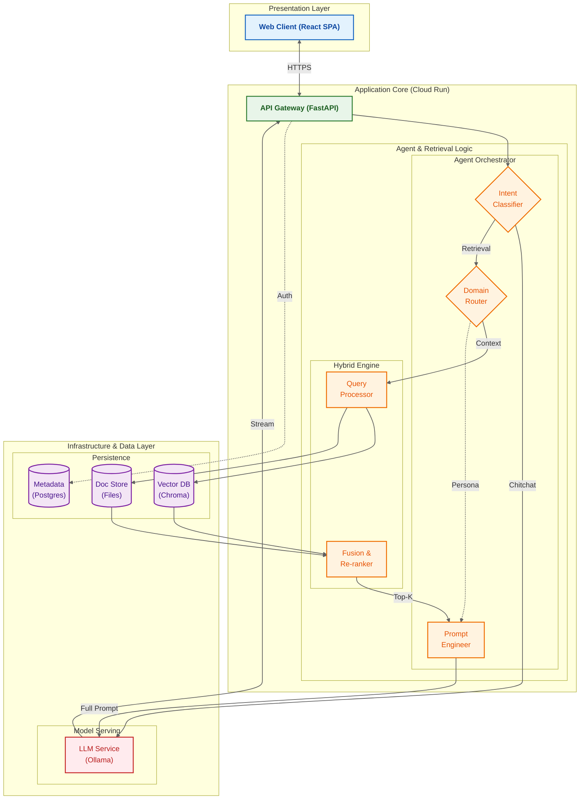

# Agentic RAG System Architecture

This document provides a comprehensive architectural overview of the Agentic RAG system, featuring both a text-based representation and a detailed academic-style diagram.

## 1. High-Level Text Architecture

The system is designed as a **Micro-Kernel Architecture** with clear separation between the Control Plane (Agent Router) and the Data Plane (Retrieval Engine).

```text
+-----------------------------------------------------------------------------+
|                        PRESENTATION LAYER (Frontend)                        |
|                                                                             |
|    [ Web Client ] ................................. (React SPA / Firebase)  |
|          |                                                                  |
+----------|------------------------------------------------------------------+
           | HTTPS / WSS
           v
+-----------------------------------------------------------------------------+
|                        APPLICATION KERNEL (Backend)                         |
|                                                                             |
|    [ API Gateway ] ............................... (FastAPI / Cloud Run)    |
|          |                                                                  |
|          v                                                                  |
|    +---------------------------+         +-----------------------------+    |
|    |  CONTROL PLANE            |         |  DATA PLANE                 |    |
|    |  (Agent Orchestrator)     |         |  (Retrieval Engine)         |    |
|    |                           |         |                             |    |
|    |  [1] Intent Classifier    |-------->|  [1] Query Processor        |    |
|    |      (Router)             |         |      (Hybrid Search)        |    |
|    |                           |         |                             |    |
|    |  [2] Domain Router        |         |  [2] Rank Fusion            |    |
|    |      (Course/Policy)      |         |      (Reranking)            |    |
|    |                           |         |                             |    |
|    |  [3] Prompt Engineer      |<--------|                             |    |
|    |      (Persona Injection)  |         |                             |    |
|    +---------------------------+         +-----------------------------+    |
|                                                                             |
+-----------------------------------------------------------------------------+
           |
           v
+-----------------------------------------------------------------------------+
|                        INFRASTRUCTURE LAYER (Data)                          |
|                                                                             |
|   [ Model Service ]    [ Vector Store ]    [ Metadata DB ]    [ Doc Store ] |
|   (Ollama / vLLM)      (ChromaDB)          (PostgreSQL)       (FileSystem)  |
+-----------------------------------------------------------------------------+
```

---

## 2. Detailed System Diagram (Academic Style)

This diagram utilizes a **nested block layout** with a **Top-Down (TB)** flow to maximize space efficiency and readability. By stacking layers vertically, we reduce horizontal whitespace and allow text to be larger and clearer.



## Architectural Design Principles

### 1. Separation of Concerns
The system strictly separates the **Orchestration Logic** (deciding *what* to do) from the **Execution Logic** (performing the search). The `Agent Router` acts as the control plane, while the `Hybrid Retrieval Engine` acts as the data plane.

### 2. Adaptive Retrieval
Unlike traditional RAG systems that treat all queries equally, this architecture implements **Domain-Aware Routing**.
- **Course Queries**: Heavily weight the vector similarity from course-specific namespaces.
- **Policy Queries**: Prioritize exact keyword matches from the official handbook to ensure compliance.

### 3. Hybrid Intelligence
The system combines:
- **Symbolic AI**: Rule-based routing and TF-IDF keyword matching for precision.
- **Neural AI**: Vector embeddings and LLM generation for semantic understanding and fluidity.
