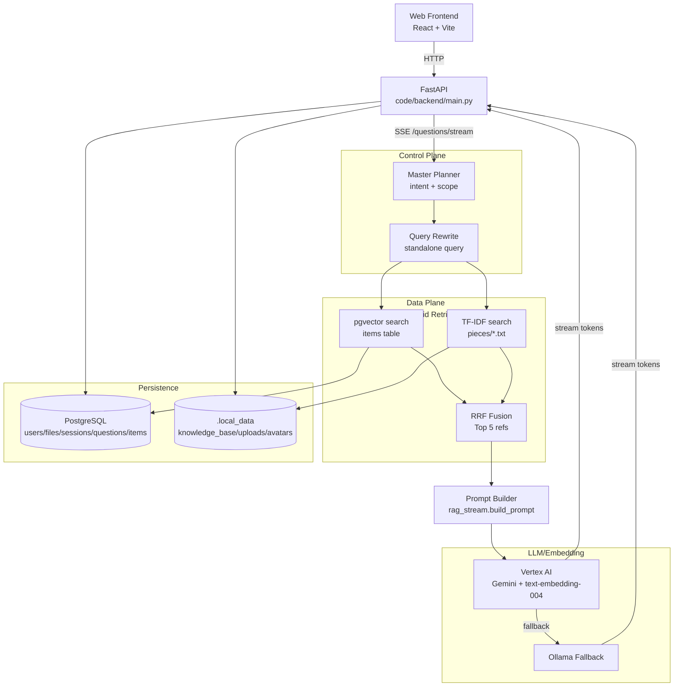

# AgenticRAG Current Architecture (Code is the Source of Truth)

This document synchronizes the "architecture and logic" of the current repository implementation to avoid discrepancies between documentation and code.

Update Time: 2026-02-28 (Based on current repository content)

---

## 1. What the Project Currently Does (Functional View)

This is a Retrieval-Augmented Generation (RAG) system for "university policies/courses/assignments":

- Frontend (web/): React + TypeScript + Vite, calls backend API via HTTP.
- Backend (code/backend/): FastAPI provides user/file/Q&A streaming interfaces.
- Retrieval: Hybrid retrieval (pgvector semantic vector retrieval + TF-IDF keyword retrieval) fused with RRF.
- Generation: Prioritizes Google Vertex AI (Gemini + text-embedding-004), falls back to local Ollama if no credentials.
- Persistence: PostgreSQL (with pgvector extension) stores metadata and vectors; files and pieces are saved in the local data directory `.local_data/` (configurable).

---

## 2. Repository Structure (Code/Runtime Data)

### 2.1 Code Directories

- web/
    - Vite React frontend, uses axios to call backend, React Router for routing.
- code/backend/
    - main.py: FastAPI entry point and all routes.
    - model/: RAG core logic (planning, retrieval, indexing, streaming generation, LLM/Embedding).
    - database/: SQLAlchemy connections and ORM models (PostgreSQL + pgvector).
    - schemas/: Pydantic request/response schemas.
- scripts/
    - Migration/validation scripts (e.g., DBFile path migration, reindex, verify).

### 2.2 Runtime Data Directories (Key Focus)

Runtime data is no longer written under code/backend/, but defaults to the repository root's `.local_data/`.

Defined uniformly by code/backend/root_path.py:

- DATA_ROOT = `${LOCAL_DATA_DIR}` or `<repo>/.local_data`
- KB_ROOT = `${DATA_ROOT}/knowledge_base`
- UPLOADS_ROOT = `${DATA_ROOT}/uploads`
- AVATARS_ROOT = `${DATA_ROOT}/avatars`

Typical layout (with "base" as the first-level directory):

```text
.local_data/
    knowledge_base/
        public/
            policies/   # Original policy files
            pieces/     # Sliced .txt from policies/ (for TF-IDF)
        course_CDS524/
            files/      # Course files
            pieces/     # Course sliced .txt
        user_123_private/
            assignments/
            pieces/
    uploads/
        temp_uploads/  # Temporary uploads (with files for Q&A context)
    avatars/
```

Note: DBFile.file_path may have historical paths; backend uses resolve_storage_path() for compatibility mapping.

---

## 3. Backend Core Components (Module View)

### 3.1 API Entry (FastAPI)

Code Location: code/backend/main.py

Main Routes (Grouped by Purpose):

- Users and Authentication
    - GET/PUT /api/v1/users/{user_id}
    - PUT /api/v1/users/{user_id}/password
    - POST /api/v1/auth/register
    - POST /api/v1/auth/login
    - POST /api/v1/users/{user_id}/avatar
    - GET /api/v1/avatars/{filename}
- Q&A (SSE Streaming)
    - POST /api/v1/chat/upload_temp (Temporary file upload, only for this question's context)
    - GET /api/v1/questions/stream (SSE: Push token by token + references + [DONE])
- File Upload and Listing
    - GET /api/v1/public/policies
    - GET /api/v1/courses /api/v1/courses/{code}/files
    - POST /api/v1/admin/policies (Admin uploads policy)
    - POST /api/v1/courses/{code}/files (Teacher/admin uploads course materials)
    - POST /api/v1/my/assignments (Student uploads assignments)
- File Preview and Deletion (With Consistency Cleanup)
    - GET /api/v1/files/preview
    - DELETE /api/v1/files/{file_id} (Authoritative deletion: Disk file + pieces + pgvector items + DBFile)
    - DELETE /api/v1/files (Legacy: Delete by base+file_name, internally redirects to delete-by-id)
- Sessions and Feedback
    - POST /api/v1/feedback
    - GET /api/v1/users/{user_id}/sessions
    - GET /api/v1/sessions/{session_id}/messages
    - DELETE /api/v1/sessions/{session_id}

### 3.2 LLM/Embedding Services (Vertex Priority, Ollama Fallback)

Code Location: code/backend/model/llm_service.py, code/backend/model/embedding.py

- Embedding: Defaults to Vertex `text-embedding-004` (768 dimensions); falls back to Ollama `/api/embeddings` (default nomic-embed-text) on failure.
- LLM:
    - task_type=fast: Gemini `gemini-2.0-flash-001`
    - task_type=complex: Gemini `gemini-2.5-pro`
    - Falls back to Ollama `/api/generate` (model controlled by OLLAMA_GEN_MODEL) if Vertex unavailable or fails.

### 3.3 Retrieval Control Plane (Agent Orchestrator)

Code Location: code/backend/model/agent_router.py

Processing Flow for Each Question (Simplified):

1. Master Planner (_planner_agent)
     - Produces intent (chat / rag_query) and search_scope (collections)
2. If intent=chat: Generate directly (can include recent conversation context)
3. Query Rewrite (_rewrite_query)
     - Rewrites follow-up into a standalone retrievable query (resolves references)
4. Hybrid Retrieval:
     - Vector retrieval: pgvector items table (filtered by collection)
     - TF-IDF: Reads segmented files in pieces directory for keyword retrieval
5. RRF Fusion (_rrf_fusion) gets Top 5 references
6. stream_answer: Incorporates references into prompt, calls LLM for streaming output

### 3.4 Data Plane (Retrieval Engine)

- TF-IDF: code/backend/model/doc_search.py
    - Pieces file format must include `--- Segment N ---` separator markers.
- Vector Store: code/backend/model/vector_store.py
    - Stored in PostgreSQL's items table (DBItem), embedding as Vector(768).
    - metadata_ includes collection_name, original_file/source, etc.
    - Query uses pgvector distance operator `<=>`.

### 3.5 Indexing

Code Location: code/backend/model/rag_indexer.py

When uploading policy/course/assignment, triggers ingest_file(base, file_path):

1. Read original file (doc_analysis.read_file)
2. Sentence segmentation with sliding window chunk (chunk_size=10, overlap=2), write to `${KB_ROOT}/{base}/pieces/{original_filename}.txt`
3. Generate embedding for each chunk, upsert to items table
     - id: `{original_filename}_chunk_{i}`
     - metadata_: Includes source (pieces filename) and original_file (original filename) and collection_name

---

## 4. End-to-End Data Flow (By Request Path)

### 4.1 Upload → Index

Example with /api/v1/admin/policies:

1. Save original file to `${KB_ROOT}/public/policies/`
2. Write DBFile (files table) record with file_name/file_path/base/access_level, etc.
3. Call ingest_file("public", file_path)
4. Generate pieces (for TF-IDF) and items vectors (for pgvector retrieval)

### 4.2 Question → Retrieval → Generation (SSE)

Entry: /api/v1/questions/stream

1. Calculate user-accessible bases (public + course_XXX + user_ID_private, depending on role/major/course)
2. Read last 3 rounds of conversation from questions table, construct conversation_history
3. route_stream executes Planner/Rewrite/Hybrid Retrieval/RRF
4. Return StreamingResponse: Output token by token, finally output references and write this round's Q&A to questions table

### 4.3 Deletion Consistency (Disk + Pieces + Vectors + DB)

Entry: DELETE /api/v1/files/{file_id}

1. Permission check (admin all; teacher course materials; student only own assignments)
2. Delete original file (resolve_storage_path compatible with old paths)
3. Delete pieces: `${KB_ROOT}/{base}/pieces/{file_name}.txt`
4. Delete vectors: items table matching collection_name + (original_file/source/id prefix)
5. Delete DBFile (files table) record

---

## 5. Database (PostgreSQL + pgvector)

### 5.1 Tables

ORM Definition Location: code/backend/database/models.py

- users: Users and roles
- sessions / questions: Sessions and messages (Q&A history)
- majors / courses: Majors and courses
- files: Uploaded file metadata (including file_path/base/file_type/access_level, etc.)
- items: Vectors and document chunks (embedding Vector(768) + metadata_ JSON)

### 5.2 pgvector Extension

Local docker-compose executes init.sql during initialization:

```sql
CREATE EXTENSION IF NOT EXISTS vector;
```

If using Cloud SQL/self-built Postgres, ensure the `vector` extension is enabled, otherwise table creation will fail (Vector type does not exist).

---

## 6. One Diagram (Current Implemented Real Chain)



---

## 7. Runtime Parameters (Environment Variables)

- DATABASE_URL: PostgreSQL connection string (required)
- LOCAL_DATA_DIR: Override `.local_data` location (optional)
- GOOGLE_APPLICATION_CREDENTIALS / VERTEX_PROJECT_ID / VERTEX_LOCATION: Vertex configuration (optional, prioritized if present)
- OLLAMA_BASE_URL / OLLAMA_GEN_MODEL: Local Ollama fallback configuration
- AUTO_CREATE_TABLES: Default 1; set to 0/false/no to not create_all on startup (for import/smoke only)
- DISABLE_LOCAL_LIBS: Default unset, runs env_setup (for local development only)

---

## 8. Key Differences from Old Documentation (Avoid "Increasing Hallucinations")

- Vector store is no longer ChromaDB: Currently PostgreSQL + pgvector (items table).
- Old layering of "Intent Classifier/Domain Router/Prompt Engineer" has been replaced by a more unified Master Planner + Query Rewrite.
- Runtime knowledge base and uploaded files no longer under code/backend/: Currently unified under repository root `.local_data/`.
- Descriptions in README.md about MySQL, env.zip are outdated (do not represent current implementation).
