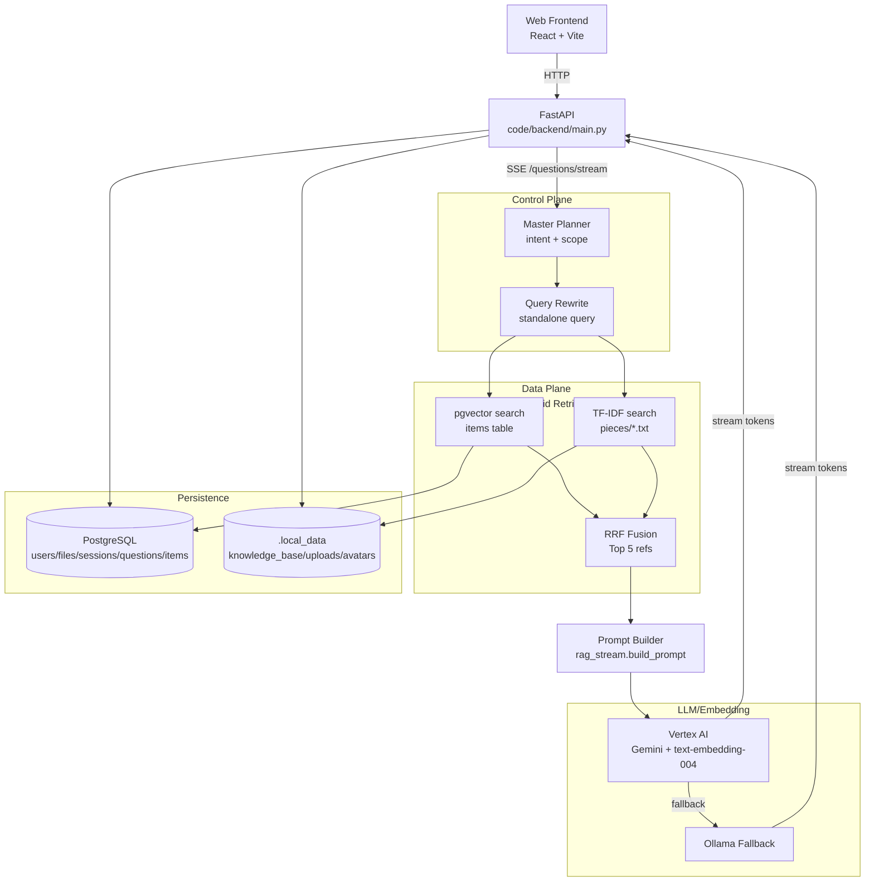

# AgenticRAG 当前架构（以代码为准）

本文件是对仓库当前实现的“架构与逻辑”同步说明，目标是避免文档与代码脱节。

更新时间：2026-02-28（基于当前仓库内容）

---

## 1. 项目当前在做什么（功能视图）

这是一个“大学政策/课程/作业”的 Retrieval-Augmented Generation（RAG）系统：

- 前端（web/）：React + TypeScript + Vite，通过 HTTP 调后端 API。
- 后端（code/backend/）：FastAPI 提供用户/文件/问答流式接口。
- 检索：混合检索（pgvector 语义向量检索 + TF-IDF 关键词检索）并用 RRF 融合。
- 生成：优先 Google Vertex AI（Gemini + text-embedding-004），无凭据则回退本地 Ollama。
- 持久化：PostgreSQL（含 pgvector 扩展）保存元数据与向量；文件与切片保存在本地数据目录 `.local_data/`（可配置）。

---

## 2. 仓库结构（代码/运行时数据）

### 2.1 代码目录

- web/
    - Vite React 前端，axios 调用后端，React Router 路由。
- code/backend/
    - main.py：FastAPI 入口与全部路由。
    - model/：RAG 核心逻辑（规划、检索、索引、流式生成、LLM/Embedding）。
    - database/：SQLAlchemy 连接与 ORM 模型（PostgreSQL + pgvector）。
    - schemas/：Pydantic 请求/响应 schema。
- scripts/
    - 迁移/校验脚本（例如 DBFile 路径迁移、reindex、verify）。

### 2.2 运行时数据目录（重点）

运行时数据不再写入 code/backend/ 下，而是默认写入仓库根目录的 `.local_data/`。

由 code/backend/root_path.py 统一定义：

- DATA_ROOT = `${LOCAL_DATA_DIR}` 或 `<repo>/.local_data`
- KB_ROOT = `${DATA_ROOT}/knowledge_base`
- UPLOADS_ROOT = `${DATA_ROOT}/uploads`
- AVATARS_ROOT = `${DATA_ROOT}/avatars`

典型布局（以“base”为一级目录）：

```text
.local_data/
    knowledge_base/
        public/
            policies/   # 原始政策文件
            pieces/     # policies/ 切片后的 .txt（供 TF-IDF）
        course_CDS524/
            files/      # 课程文件
            pieces/     # 课程切片 .txt
        user_123_private/
            assignments/
            pieces/
    uploads/
        temp_uploads/  # 临时上传（问答时带文件）
    avatars/
```

注意：DBFile.file_path 可能存在历史路径，后端通过 resolve_storage_path() 做兼容映射。

---

## 3. 后端核心组件（模块视图）

### 3.1 API 入口（FastAPI）

代码位置：code/backend/main.py

主要路由（按用途分组）：

- 用户与鉴权
    - GET/PUT /api/v1/users/{user_id}
    - PUT /api/v1/users/{user_id}/password
    - POST /api/v1/auth/register
    - POST /api/v1/auth/login
    - POST /api/v1/users/{user_id}/avatar
    - GET /api/v1/avatars/{filename}
- 问答（SSE 流式）
    - POST /api/v1/chat/upload_temp（临时文件上传，仅用于本次提问上下文）
    - GET /api/v1/questions/stream（SSE：逐 token 推送 + references + [DONE]）
- 文件上传与列表
    - GET /api/v1/public/policies
    - GET /api/v1/courses /api/v1/courses/{code}/files
    - POST /api/v1/admin/policies（管理员上传 policy）
    - POST /api/v1/courses/{code}/files（老师/管理员上传课程资料）
    - POST /api/v1/my/assignments（学生上传作业）
- 文件预览与删除（含一致性清理）
    - GET /api/v1/files/preview
    - DELETE /api/v1/files/{file_id}（权威删除：磁盘文件 + pieces + pgvector items + DBFile）
    - DELETE /api/v1/files（legacy：按 base+file_name 删除，内部转到 delete-by-id）
- 会话与反馈
    - POST /api/v1/feedback
    - GET /api/v1/users/{user_id}/sessions
    - GET /api/v1/sessions/{session_id}/messages
    - DELETE /api/v1/sessions/{session_id}

### 3.2 LLM/Embedding 服务（Vertex 优先，Ollama 回退）

代码位置：code/backend/model/llm_service.py、code/backend/model/embedding.py

- Embedding：默认使用 Vertex `text-embedding-004`（768 维）；失败时回退 Ollama `/api/embeddings`（默认 nomic-embed-text）。
- LLM：
    - task_type=fast：Gemini `gemini-2.0-flash-001`
    - task_type=complex：Gemini `gemini-2.5-pro`
    - Vertex 不可用或失败则回退 Ollama `/api/generate`（模型由 OLLAMA_GEN_MODEL 控制）。

### 3.3 检索控制面（Agent Orchestrator）

代码位置：code/backend/model/agent_router.py

对每个问题的处理流程（简化版）：

1. Master Planner（_planner_agent）
     - 产出 intent（chat / rag_query）和 search_scope（collections）
2. 若 intent=chat：直接生成（可带最近对话上下文）
3. Query Rewrite（_rewrite_query）
     - 把追问改写成可独立检索的 query（消解指代）
4. Hybrid Retrieval：
     - 向量检索：pgvector items 表（按 collection 过滤）
     - TF-IDF：读取 pieces 目录下分段文件做关键词检索
5. RRF 融合（_rrf_fusion）得到 Top 5 references
6. stream_answer：将 references 编入 prompt，调用 LLM 流式输出

### 3.4 数据面（Retrieval Engine）

- TF-IDF：code/backend/model/doc_search.py
    - pieces 文件格式必须包含 `--- Segment N ---` 分隔标记。
- 向量库：code/backend/model/vector_store.py
    - 存储在 PostgreSQL 的 items 表（DBItem），embedding 为 Vector(768)。
    - metadata_ 中包含 collection_name、original_file/source 等。
    - 查询使用 pgvector 距离算子 `<=>`。

### 3.5 索引（Indexing）

代码位置：code/backend/model/rag_indexer.py

当上传 policy/course/assignment 时，会触发 ingest_file(base, file_path)：

1. 读取原文件（doc_analysis.read_file）
2. 句子切分并做滑窗 chunk（chunk_size=10, overlap=2），写入 `${KB_ROOT}/{base}/pieces/{original_filename}.txt`
3. 对每个 chunk 生成 embedding，并 upsert 到 items 表
     - id：`{original_filename}_chunk_{i}`
     - metadata_：包含 source（pieces 文件名）与 original_file（原始文件名）与 collection_name

---

## 4. 端到端数据流（按请求路径）

### 4.1 上传 → 索引

以 /api/v1/admin/policies 为例：

1. 保存原文件到 `${KB_ROOT}/public/policies/`
2. 写 DBFile（files 表）记录 file_name/file_path/base/access_level 等
3. 调用 ingest_file("public", file_path)
4. 生成 pieces（供 TF-IDF）与 items 向量（供 pgvector 检索）

### 4.2 提问 → 检索 → 生成（SSE）

入口：/api/v1/questions/stream

1. 计算用户可访问 bases（public + course_XXX + user_ID_private，取决于角色/专业/课程）
2. 从 questions 表读取最近 3 轮对话，构造 conversation_history
3. route_stream 执行 Planner/Rewrite/Hybrid Retrieval/RRF
4. 返回 StreamingResponse：逐 token 输出，同时最终输出 references 并把本轮问答写入 questions 表

### 4.3 删除一致性（磁盘 + pieces + 向量 + DB）

入口：DELETE /api/v1/files/{file_id}

1. 权限检查（admin 全部；teacher 课程资料；student 仅自己作业）
2. 删除原文件（resolve_storage_path 兼容旧路径）
3. 删除 pieces：`${KB_ROOT}/{base}/pieces/{file_name}.txt`
4. 删除向量：items 表中匹配 collection_name + (original_file/source/id 前缀)
5. 删除 DBFile（files 表）记录

---

## 5. 数据库（PostgreSQL + pgvector）

### 5.1 表

ORM 定义位置：code/backend/database/models.py

- users：用户与角色
- sessions / questions：会话与消息（问答历史）
- majors / courses：专业与课程
- files：上传文件元数据（含 file_path/base/file_type/access_level 等）
- items：向量与文档 chunk（embedding Vector(768) + metadata_ JSON）

### 5.2 pgvector 扩展

本地 docker-compose 会在初始化时执行 init.sql：

```sql
CREATE EXTENSION IF NOT EXISTS vector;
```

如果你用 Cloud SQL/自建 Postgres，需要确保同样启用 `vector` 扩展，否则建表会失败（Vector 类型不存在）。

---

## 6. 一张图（当前实现的真实链路）



---

## 7. 运行参数（环境变量）

- DATABASE_URL：PostgreSQL 连接串（必需）
- LOCAL_DATA_DIR：覆盖 `.local_data` 位置（可选）
- GOOGLE_APPLICATION_CREDENTIALS / VERTEX_PROJECT_ID / VERTEX_LOCATION：Vertex 配置（可选，有则优先使用）
- OLLAMA_BASE_URL / OLLAMA_GEN_MODEL：本地 Ollama 回退配置
- AUTO_CREATE_TABLES：默认 1；为 0/false/no 时不在启动时 create_all（用于仅 import/smoke）
- DISABLE_LOCAL_LIBS：默认未设置时会运行 env_setup（仅用于本地开发环境）

---

## 8. 与旧文档的关键差异（避免“越改越幻觉”）

- 向量库不再是 ChromaDB：当前是 PostgreSQL + pgvector（items 表）。
- “Intent Classifier/Domain Router/Prompt Engineer”旧分层已被更统一的 Master Planner + Query Rewrite 替代。
- 运行时知识库与上传文件默认不在 code/backend/ 下：当前统一落在仓库根 `.local_data/`。
- README.md 中关于 MySQL、env.zip 的描述已过期（不代表当前实现）。
