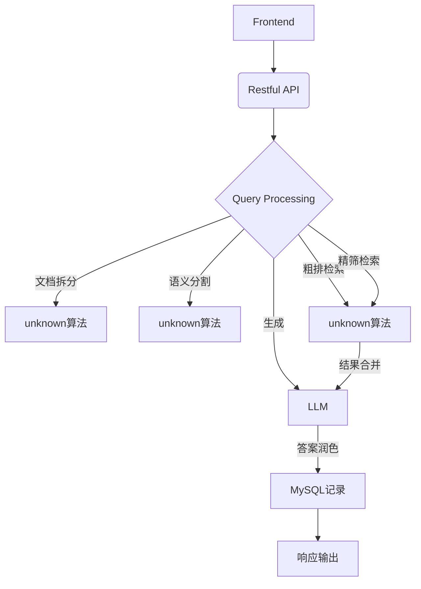

# AgentRAG

## 需求分析

### 1. 系统概述
本系统旨在为校园内的师生提供一个实时的政策问答平台，借助检索增强生成（RAG）技术，提供精准、实时的答案查询服务。用户可以通过自然语言提问，系统基于已有的政策文件和数据库返回相关答案，帮助学生、教职工、外部客户快速获取信息。

### 2. 功能需求
- **用户身份认证**：置于学校官网，公开访问权限，免除身份认证。
- **实时问答**：用户可以通过自然语言提问，系统将自动从政策数据库中检索相关信息并生成答案。
- **多轮对话支持**：支持用户多轮交互，能够理解上下文关系，提供更加准确的回答。
- **后台管理系统**：仅管理员可以上传文档，更新政策内容，查看问答记录。网页窗口不记录历史问答，用户刷新网页后无历史问答。
- **数据更新和维护**：自动定期更新政策文件，确保系统回答的准确性和时效性。
- **反馈机制**：用户可以对回答进行评价，帮助优化系统。

### 3. 性能需求
- **响应时间**：系统应能在3秒内返回查询结果。
- **并发处理能力**：支持高并发访问，保证系统在高流量下的稳定性。

### 4. 整体流程

---
## 逻辑设计

### 1. 系统架构
本系统采用前后端分离的架构，前端使用**unknown**进行开发，后端使用FastAPI进行开发，前后端通过RESTful API进行通信。数据存储方面，使用MySQL数据库来存储校园政策和历史数据内容，使用**unknown**进行文本检索。

#### 主要模块
- **前端模块**：负责用户交互，发送请求和展示回答。
- **后端模块**：负责处理用户请求，调用RAG算法进行检索和生成答案。
- **数据库模块**：存储和管理校园政策文档。
- **算法模块**：实现RAG模型，通过检索和生成技术提供实时准确的问答服务。

### 2. 数据库设计
数据库中主要包含以下表：
- **Policy Table**：存储政策相关信息（如政策ID，标题，内容，发布时间等）。
- **Question Table**：存储用户提问内容和回答记录和回答质量评分。

---
## 实现设计

### 1. 前端设计
- **用户界面**：设计简洁直观的界面，允许用户快速输入问题，并显示系统返回的答案。
- **交互设计**：使用**unknown**实现单页面应用，通过AJAX请求与后端进行数据交换。

### 2. 后端设计
- **API设计**：使用FastAPI框架构建RESTful API，提供以下端点：

- **算法实现**：
  - 使用RAG（Retrieval-Augmented Generation）技术，将用户的问题与政策数据库进行检索，找到相关内容。
  - 使用预训练语言模型（如GPT或T5）进行生成式回答。

- **数据存储**：使用MySQL数据库存储用户信息和政策内容，使用**unknown**进行文本检索以加速查询。

### 3. 安全设计
- 记录请求数量，超出每分钟100个问题直接返回服务不可用。

---

## RESTful API设计

### 1. 用户提问接口

### 2. 回答质量评分接口

### 3. 政策文档上传接口

### 4. 政策文档查看接口

